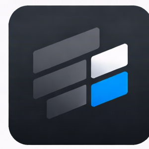

<p align="center">
  
</p>

<p align="center">
  <a href="https://github.com/dhairyagabha/reviewkit/actions/workflows/ci.yml">
    
  </a>
  <a href="https://rubygems.org/gems/reviewkit">
    
  </a>
</p>

<p align="center">
  <a href="https://reviewkit.dhairyagabhawala.com">Documentation</a>
  ·
  <a href="https://reviewkit.dhairyagabhawala.com/examples/live-demo">See the demo</a>
  ·
  <a href="https://github.com/dhairyagabha/reviewkit/blob/main/CHANGELOG.md">Changelog</a>
  ·
  <a href="https://rubygems.org/gems/reviewkit">RubyGems</a>
  ·
  <a href="https://github.com/dhairyagabha/reviewkit">GitHub</a>
</p>

# Reviewkit

`reviewkit` is a mountable Rails engine for Git-like review workflows. It stores immutable review documents, renders split and unified diffs, supports threaded line comments, and ships a Rails-only UI built with Turbo, Stimulus, importmap, TailwindCSS, and Rouge.

The engine stays intentionally generic. Host applications bring their own review source, metadata, permissions, and workflow logic while Reviewkit handles the review surface itself.

## Features

- Split and unified diff rendering for virtual files or real files
- Threaded line comments with resolve, reopen, and outdated states
- Immutable review snapshots built from host-provided content
- Searchable review index and Git-style file review UI
- Turbo Frame embedding and Turbo Stream updates
- Rails-only frontend runtime with no Node requirement
- JSON metadata on reviews, documents, threads, and comments
- Rails-native extension via generated model and controller concerns
- `ActiveSupport::Notifications` events for lifecycle and status changes

## Requirements

- Ruby `>= 3.2.0`
- Rails `>= 8.1.2`, `< 8.2`

CI currently verifies Ruby `3.2`, `3.3`, `3.4`, and `4.0` against the Rails `8.1` line, so the published dependency matches that support window.

## Installation

Add the gem to your Rails app:

```ruby
gem "reviewkit"
```

Then install it:

```bash
bundle install
bin/rails generate reviewkit:install
bin/rails db:migrate
```

The installer:

- copies `config/initializers/reviewkit.rb`
- mounts `Reviewkit::Engine` unless disabled
- installs the engine migrations into the host app
- creates a minimal `config/importmap.rb` when one does not exist

By default the engine mounts at `/reviewkit`:

```ruby
mount Reviewkit::Engine => "/reviewkit"
```

If you want local copies of the shipped UI templates:

```bash
bin/rails generate reviewkit:views
```

## Create a Review

Host applications provide immutable review documents. The main entry point is `Reviewkit::Reviews::Create`.

```ruby
review = Reviewkit::Reviews::Create.call(
  title: "Checkout submission hardening",
  description: "Review the guard clauses and status changes before merge.",
  creator: current_user,
  external_reference: "PR-42",
  status: "open",
  metadata: {
    branch: "feature/checkout-guard",
    base_branch: "main",
    commit_sha: "9f3c1d2"
  },
  review_attributes: {
    review_type: "code"
  },
  documents: [
    {
      path: "app/services/checkouts/submit_order.rb",
      language: "ruby",
      old_content: "def call(order)\n  order.submit!\nend\n",
      new_content: "def call(order)\n  return false unless order.ready?\n\n  order.submit!\nend\n",
      metadata: {
        resource_id: "submit_order",
        revision_id: "9f3c1d2",
        base_revision_id: "8b21e6a"
      }
    }
  ]
)
```

Once created, the mounted UI is available at:

```text
/reviewkit/reviews/:id
```

## Configuration

Reviewkit keeps configuration deliberately small:

```ruby
Reviewkit.configure do |config|
  config.current_actor = lambda do |controller|
    controller.respond_to?(:current_user, true) ? controller.send(:current_user) : nil
  end

  config.authorize_action = lambda do |_controller, action, record = nil, **_context|
    true
  end

  config.layout = "reviewkit/application"
  config.intraline_limits.max_review_files = 50
  config.intraline_limits.max_changed_lines = 50
  config.intraline_limits.max_line_length = 500
end
```

The most important knobs are:

- `config.current_actor` for comments, thread resolution, and notification context
- `config.authorize_action` for engine permissions
- `config.layout` for full-page rendering
- `config.intraline_limits` for conservative intraline diff budgets on large reviews

## RBS Signatures

Reviewkit ships RBS for the public engine surface in [`sig/reviewkit.rbs`](sig/reviewkit.rbs).

The signatures cover:

- `Reviewkit.configure` and `Reviewkit.config`
- `Reviewkit::Configuration` and `Reviewkit::Configuration::IntralineLimits`
- `Reviewkit::Current`
- `Reviewkit::Reviews::Create`
- the core review records' public workflow helpers

## Records and Workflow

Reviewkit ships four core records:

- `Reviewkit::Review`
- `Reviewkit::Document`
- `Reviewkit::ReviewThread`
- `Reviewkit::Comment`

Review statuses:

- `draft`
- `open`
- `approved`
- `rejected`
- `closed`

Document statuses:

- `added`
- `removed`
- `modified`
- `unchanged`

Thread statuses:

- `open`
- `resolved`
- `outdated`

## Extend It the Rails Way

Reviewkit is designed to be extended with normal Rails patterns:

- use Active Record callbacks in host-side model concerns
- override protected controller methods in host-side controller concerns
- copy views only when you need UI changes
- keep domain-specific fields in host migrations and JSON metadata

Generate host-side extension concerns:

```bash
bin/rails generate reviewkit:models
bin/rails generate reviewkit:controllers
```

After adding a host column like `review_type`, extend the engine through those concerns instead of forking the engine.

Keep host extensions in the normal Rails autoloaded concern paths:

- `app/models/concerns/reviewkit`
- `app/controllers/concerns/reviewkit`

The engine's `to_prepare` hooks look up those constants by name, so keeping them in the generated concern paths avoids manual requires and keeps development reloading clean.

Example controller extension:

```ruby
module Reviewkit
  module ReviewsControllerExtension
    protected

    def permitted_review_attributes
      super + %i[review_type]
    end
  end
end
```

## Embed Reviews in Turbo Frames

Reviewkit review pages can be embedded inside host layouts with Turbo Frames:

```erb
<%= turbo_frame_tag "reviewkit_review", src: reviewkit.review_path(review) %>
```

Frame requests:

- skip the full-page engine layout
- keep inline comment, reply, and thread state updates working
- preserve Turbo-driven document switching

## Metadata

Reviewkit intentionally keeps integration context in JSON metadata rather than dedicated vendor-specific columns.

Typical examples:

```ruby
review.metadata = {
  branch: "feature/checkout-guard",
  base_branch: "main"
}

document.metadata = {
  resource_id: "submit_order",
  revision_id: "9f3c1d2"
}

thread.metadata = {
  resource_id: "submit_order",
  side: "new"
}
```

## Notifications

Reviewkit emits observational `ActiveSupport::Notifications` events for review, thread, and comment lifecycle/status changes.

These are useful for:

- analytics
- auditing
- background workflows

Host applications should still prefer normal Rails callbacks for domain behavior attached to their own model extensions.

## Documentation

Full guides, live demos, API details, extension examples, and troubleshooting are available at:

- https://reviewkit.dhairyagabhawala.com

Recommended starting points:

- https://reviewkit.dhairyagabhawala.com/docs/installation
- https://reviewkit.dhairyagabhawala.com/docs/quick-start
- https://reviewkit.dhairyagabhawala.com/docs/host-integration
- https://reviewkit.dhairyagabhawala.com/examples/live-demo

## Development

```bash
bin/setup
bin/test
bin/lint
bundle exec bin/rails app:zeitwerk:check
bundle exec rake reviewkit:build_assets
```

The dummy host app used for engine verification lives under `spec/dummy`.

## Release Workflow

Reviewkit is prepared for RubyGems Trusted Publishing with GitHub Actions.

Before the first public release:

1. Create the gem on RubyGems.org.
2. Add this repository as a trusted publisher for the gem.
3. Create a protected `release` environment in GitHub if you want an approval gate before publish.

After that, publish by pushing a SemVer tag:

```bash
git tag v0.1.0
git push origin v0.1.0
```

## Contributing

See [CONTRIBUTING.md](CONTRIBUTING.md) for development and contribution guidelines.

Please follow the [Code of Conduct](CODE_OF_CONDUCT.md) when participating in issues, discussions, and pull requests.

## License

The gem is available as open source under the terms of the [MIT License](MIT-LICENSE).
